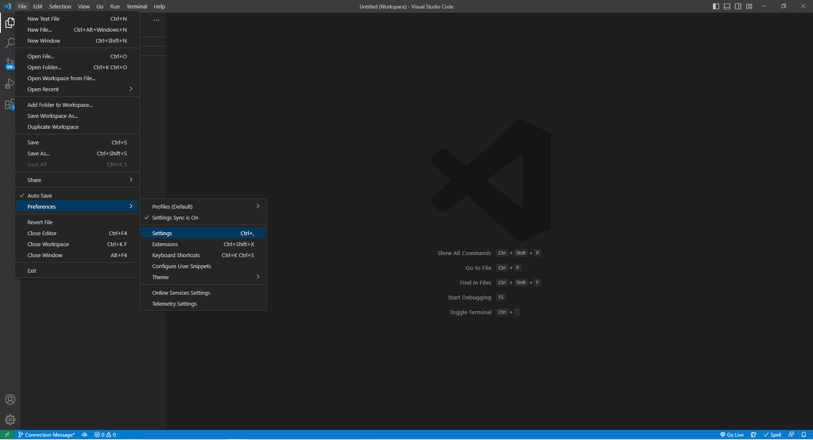

# Text Editor Progressive Web Application (PWA)

## Description

This project is a text editor progressive web application that primarily runs in a browser but can operate offline. It also features data persistence techniques, allowing for getting and storing data from an `IndexedDB database`, regardless of internet connectivity. This project utilizes a package called `idb`, which is a lightweight wrapper around the IndexedDB API. `idb` is a popular wrapper, used by major companies such as Google and Mozilla, featuring a number of methods that are used to store and retrieve data.

## Table of Contents
- [Installation](#installation-for-further-development-only)
    - [Git/GitBash](#gitgitbash---strongly-recommended)
    - [Visual Studio Code](#visual-studio-code-vsc---strongly-recommended)
    - [Node (REQUIRED)](#node-version-16---required-to-download-node-based-dependencies-ie-mongoose-and-express)
    - [dependencies (REQUIRED)](#dependencies---required)
- [Usage](#usage)
- [Credits](#credits)
- [Questions](#questions)

## Installation (for further development only)

Make sure the following are downloaded:

### `Git/GitBash` - *Strongly Recommended*
* While this application can be run using with the default **command prompt**, it is easier to clone this repository by using Git/GitBash, which can be downloaded [here](https://git-scm.com/downloads).

### `Visual Studio Code [VSC]` - *Strongly Recommended*

* If you'd like to make changes to these files, Visual Studio Code is recommended and can be downloaded for free [here](https://code.visualstudio.com/download).

### `Node version 16` - **REQUIRED** to download node-based dependencies (i.e. express)
* Go to [Node's homepage, https://nodejs.org/en/](https://nodejs.org/en/), then [Downloads](https://nodejs.org/en/download/) and scroll down to the [Previous Releases](https://nodejs.org/en/download/releases/) bullet point. 

* Toggle between the results until the desired version 16 package and click Download. This application was developed with [Node.js version 16.18.0](https://nodejs.org/dist/v16.18.0/), click on [node-v16.18.0-x64.msi](https://nodejs.org/download/release/v16.18.0/node-v16.18.0-x64.msi) to download.

* The Full-Stack Blog also has [instructions on how to download Node](https://coding-boot-camp.github.io/full-stack/nodejs/how-to-install-nodejs).

### `dependencies` - **REQUIRED**

* These **MUST** be installed into this repository, start by opening the command line interface.

* If you have Visual Code Studio, add this repository to the workspace. Then, go to 'Settings' either through the cog icon in the lower left corner and clicking Settings, go to File -> Preferences -> Settings in the menu bar, or the key combo of Ctrl+,

Method 1 - Cog:

Method 2 - File > Preferences > Setting:

* Then, change the settings in "Terminal: Explorer Kind" to "external" in the drop down menu.

        
* Change the filepath of the "Terminal > External: [respective operating system]" settings to the preferred command line interface program (either your system's Command Prompts's file path or Git/Git Bash's file path)

* After that, right-click the repository and select "Open in External Terminal"

* If you do not have VSC, open the preferred terminal.

* Use "cd Desktop" to first reach the Desktop, cd stands for change directory.

* Continue using "cd" to navigate through the file path to reach the location of this repository on your computer.

* Once the root directory of this repository has been reached, due to the large amount of dependencies, type in `npm run install` to install all dependencies. This will include all the dependencies written in the `package.json` file

## Usage

* This full-stack application's online version is deployed [here](https://jate-lee-claire-156.herokuapp.com/) on Heroku. After clicking the link, write whatever you'd like! As a PWA, it is also available to be downloaded as an application that can be used offline and will sync once it obtains internet connection.

* To download, click on the Install button on the upper left hand side of the webpage. After clicking, a prompt will appear. Once this application has been installed, the install button will no longer show the installation prompt upon clicking.

### Developmental Usage

* Follow the same methods from the [Dependencies Installation Section](#dependencies---required) to reach the root directory of this repository if you've already exited out of the command-line, then type in `npm run start` and hit `Enter`. *Note* that using `npm run start` will require you to delete and recreate the `dist` folder after each change. It is highly recommended to use `start:dev` for the developmental stages.

* Got to localhost:3000 on your device to view the application.

## Credits

* Credit to George Washington University's Full Stack Coding Camp Week 19: PWA Activity 28-Stu_Mini-Project for basis of the majority of code in the package.json, client/webpack.config.js, client/src-sw.js, client/src/js/install.js, and client/src/js/database.js files, and Activity  26-Stu_Manifest for other half of code in the client/js/database.js file.

* Credit to [Jeanluca Scaljeri](https://stackoverflow.com/users/419425/jeanluca-scaljeri) and [MrWillihog](https://stackoverflow.com/users/461823/mrwillihog) for providing information on `progress=false` function in `.npmrc` file:  https://stackoverflow.com/questions/37831348/how-to-disable-npms-progress-bar

## Questions

If you have any questions, my GitHub profile is www.github.com/leeclaire156, and my email is lee.claire156@gmail.com.